# Bidstack Adapter IronSource iOS installation guide

The Bidstack IronSource Adapter for iOS allows you to display Interstitial and Rewarded ads in your app through IronSource Mediation.

## Table of contents

- [Prerequisites](#prerequisites)
- [Integration](#integration)
- [Supported versions](#supported-versions)

## Prerequisites

**Required:** iOS version 10+

**Required:** If you're planning to integrate adapter manually, then you need to download **BidstackCustomAdapterIronSource.xcframework** and **BidstackMobileAdsSDK.xcframework** from [here](https://console.bidstack.com/developer/downloads). (Look for IronSource Mediation Adapter -> iOS)

Before integrating the adapter you will need to set up the Bidstack network on your IronSource account
as documented [here](https://developers.is.com/ironsource-mobile/general/custom-adapter-setup/) or follow the instructions in the header [Configure the ad network account settings](#configure-the-ad-network-account-settings)
and integrate the IronSource SDK as documented [here](https://developers.is.com/ironsource-mobile/ios/ios-sdk/).

#### Configure the ad network account settings

1. Log in to your IronSource account and go to **Monetize > Setup > SDK Networks** and click `Manage Networks`

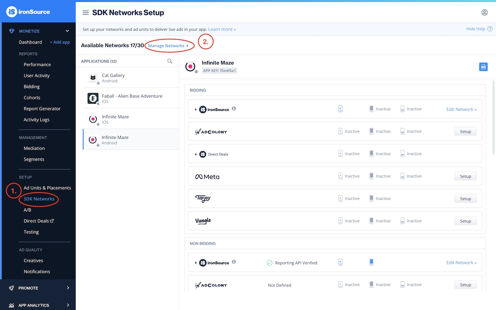

2. Select Custom Adapter at the end of the list

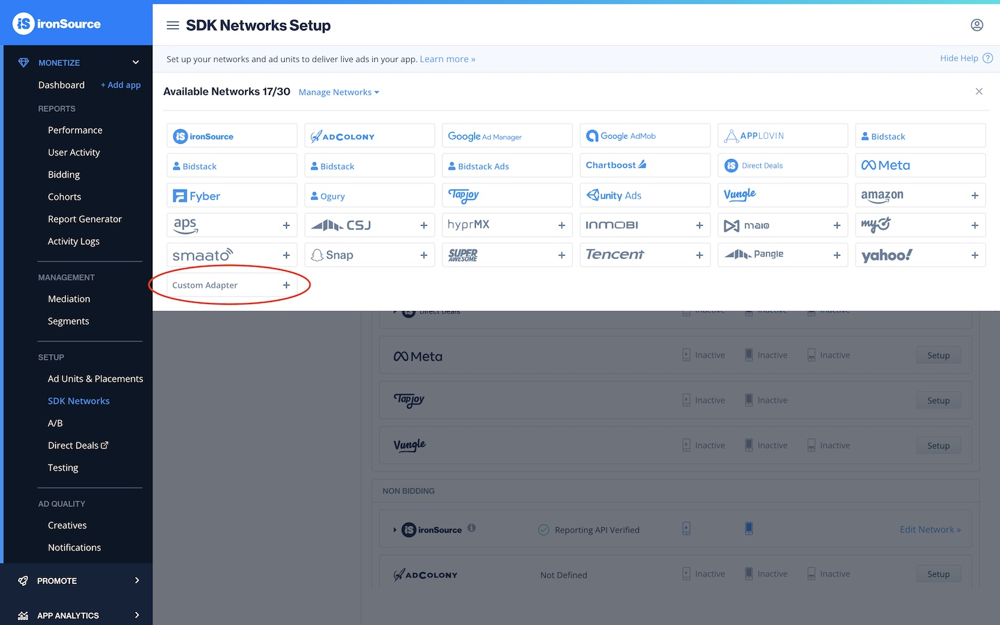

3. When prompted for `Network Key` enter `15bb61a5d`

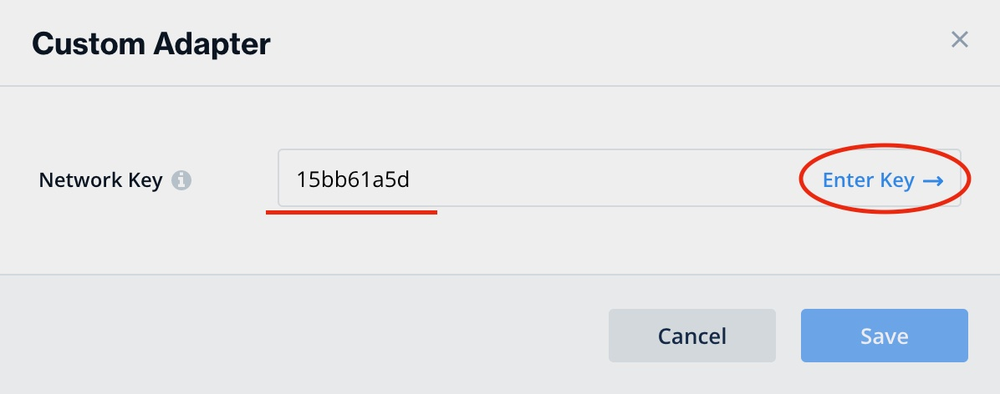

4. Once IronSource recognizes the key, you should see `Bidstack Ads` as `Name`.
5. Your `Publisher ID` is the email address that you signed up to the AdConsole with.
6. Your `Reporting API key` key will be provided by Bidstack.
7. For the Reported Revenue section - select Rate-based revenue due to new instances having no historical data and no eCPM, you should set a rate on the instance until the actual eCPM is populated.

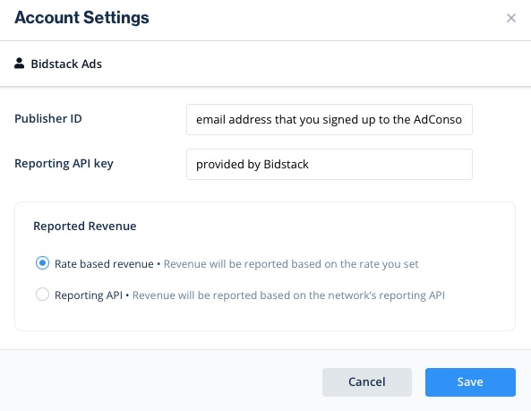

#### Configure app

You will need to gather API key and ad unit ID's which can be obtained in [AdConsole](https://console.bidstack.com/auth/login).
Once you have obtained the credentials, set them up in your IronSource account as documented
[here](https://developers.is.com/ironsource-mobile/general/custom-adapter-setup/#step-3).

1. In the ironSource dashboard go to **Monetize > Setup > SDK Networks** and scroll down to the `Custom` section. Then press on the pencil icon alongside the Bidstack adapter

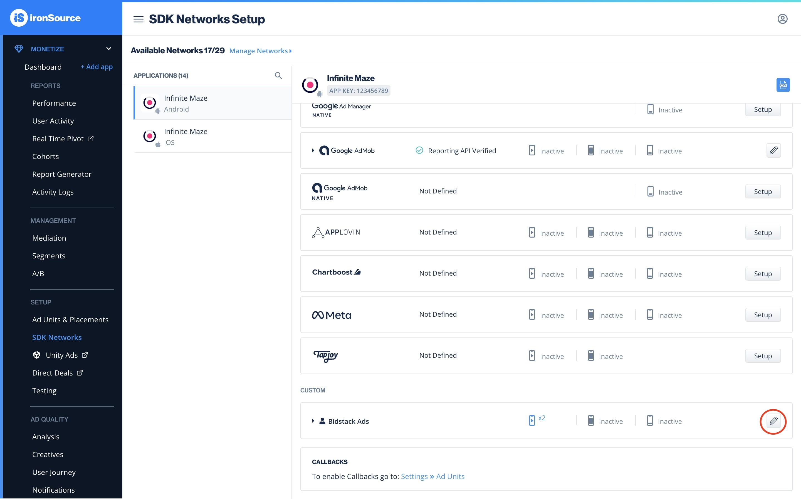

2. Here you will need to enter the API key and ad unit ID from the AdConsole. Also, you can manually specify the rate to prioritize Bidstack Ads. To add more than 1 add unit ID select `+Add Network Instance`

3. Login into your AdConsole account and add a new game or select existing

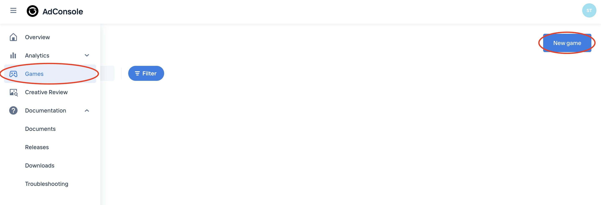

4. From the navigation menu select `SDK control panel` and copy the API key. Paste this API key in the IronSource dashboard

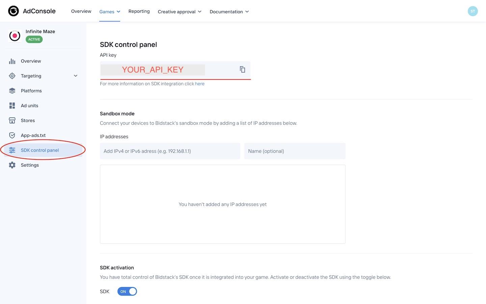

5. From the navigation menu select `Ad units`. And then create and copy ad unit id. Also, paste the ad unit id in the IronSource dashboard

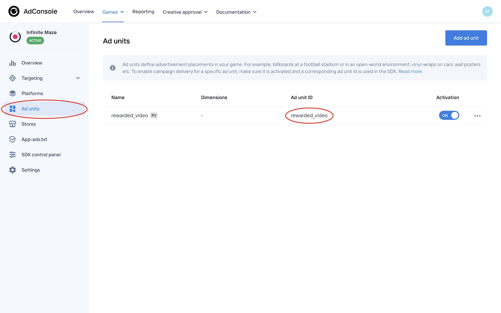

When prompted for `App Settings`:
1. `Application Key` is the API key you retrieved from AdConsole
2. `Placement Id` is `Ad unit ID` you retrieved from AdConsole

## Integration

There are two ways how you can integrate **BidstackCustomAdapterIronSource** into your project - using cocoapods or adding xcframeworks manually. 

### 1. Using cocoapods

Add to your podfile:
`pod 'BidstackCustomAdapterIronSource', '~> 1.5.0'`

That's it! Now you can `pod install` from your Terminal and **BidstackCustomAdapterIronSource** and **BidstackMobileAdsSDK** will be installed automatically. No additional steps needed.

### 2. Add xcframeworks manually

#### 1. Create **Frameworks** folder

First of all, double check if your Xcode project contains a **Frameworks** folder in project navigator. If it doesn’t, just like in the screenshot below, then we’ll have to create one. The Frameworks folder is not added by default in latest Xcode and it’s a good practice to keep your frameworks there.

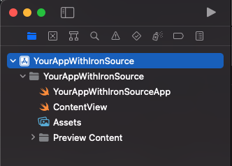

Right click on your project in the project navigator (top-most entry) and select “New Group”. Name the new group **Frameworks**.

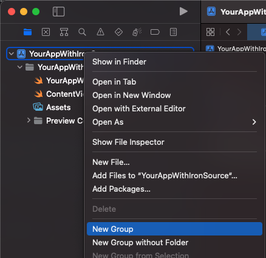 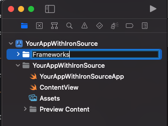

#### 2. Add BidstackIronSourceAdapter.xcframework and BidstackMobileAdsSDK.xcframework to Frameworks folder

There are two ways how to add an BidstackIronSourceAdapter.xcframework and BidstackMobileAdsSDK.xcframework to the Frameworks folder. 

##### 1. Drag and drop both frameworks from Finder into the **Frameworks** folder. Make sure that the destination of drag is just under the Frameworks folder:

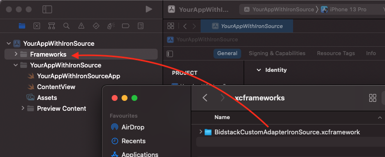

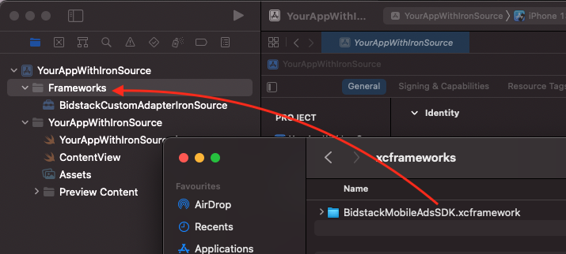

Then, make sure the following options are selected for adding files. Both “Copy items if needed” and “Create groups” should be checked and selected. Click Finish.

##### 2. Alternatively, with the Frameworks folder selected, click on File -> Add Files to “Your Project”

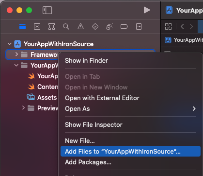

Find the  BidstackIronSourceAdapter.xcframework and BidstackMobileAdsSDK.xcframework in the file navigator, select it, make sure “Copy items if needed” and “Create groups” are selected and click `Add`:

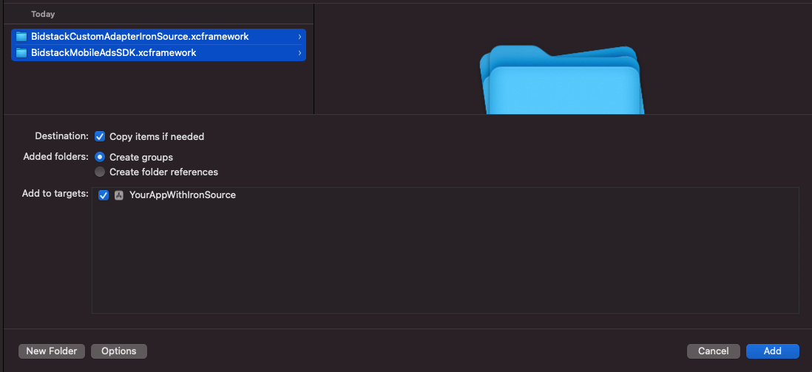

#### 3. Embed BidstackMobileAdsSDK.xcframework in project’s target

In order to make sure that the framework will get copied to your app’s binary, follow these steps:

1. Navigate to your project settings by clicking on it in the project navigator. 
2. Make sure that your target is selected and General tab is open.
3. Select `Embed & Sign` for your newly added **BidstackMobileAdsSDK.xcframework**.
4. Make sure that **BidstackIronSourceAdapter.xcframework** has `Do Not Embed` selected.

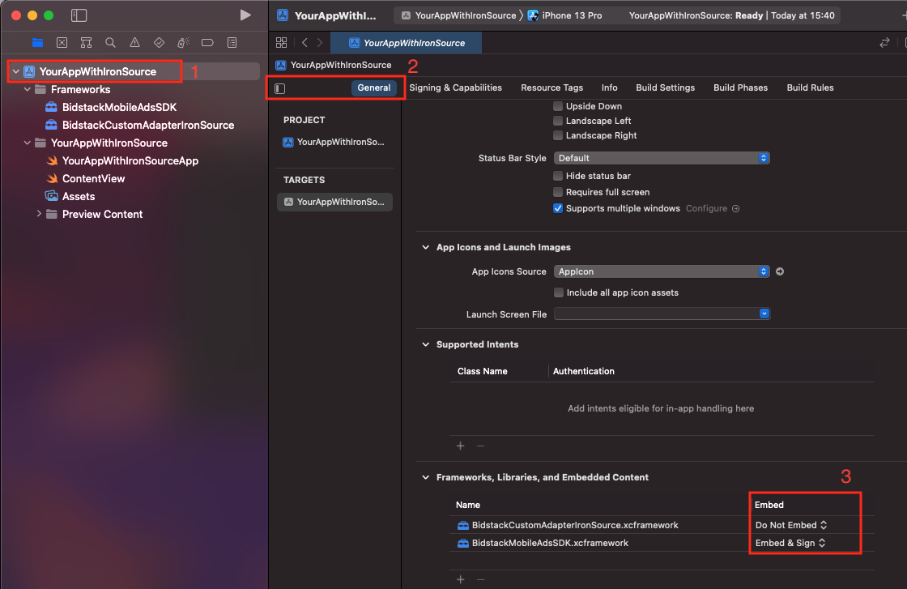

#### 4. Link BidstackIronSourceAdapter.xcframework and BidstackMobileAdsSDK.xcframework with your project

Navigate to the Build Phases tab, disclose the “Link Binary With Libraries” list and make sure your frameworks is included in the list. It should already be included by default after following the steps above, however in case it’s not – click on the + button and add it.

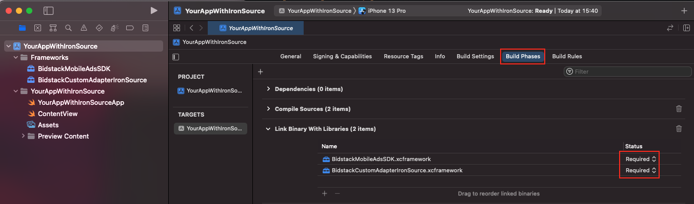

### The **BidstackIronSourceAdapter.xcframework** and **BidstackMobileAdsSDK.xcframework** is now fully added and integrated with your Xcode project. No additional setup is needed.

## Supported versions

Supported **IronSourceSDK** versions: 7.2.0 and up

Supported **iOS** versions: version 10+
