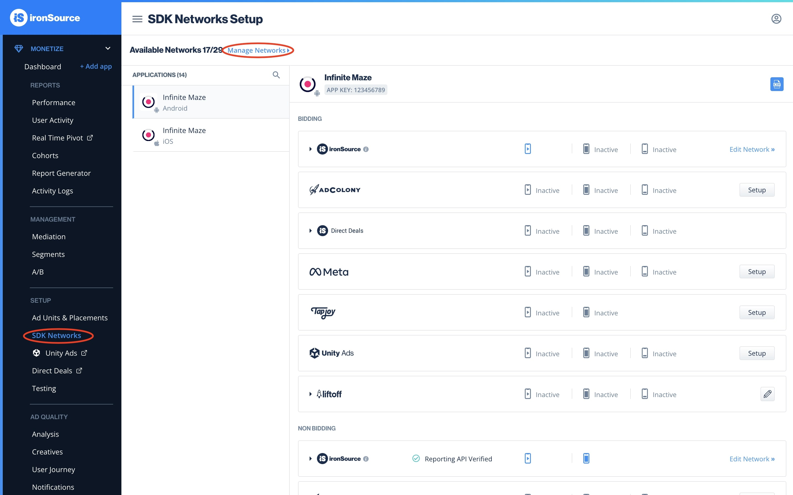
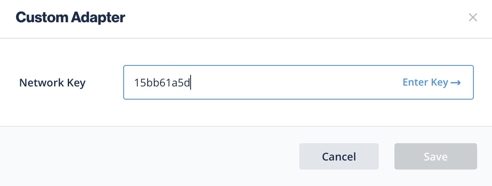
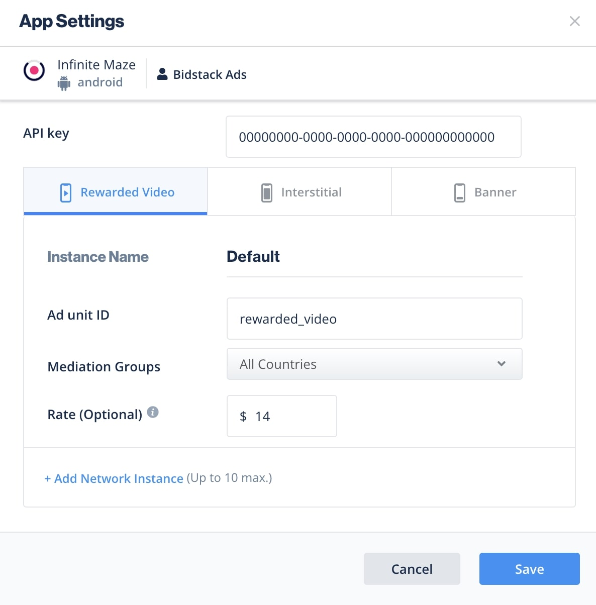
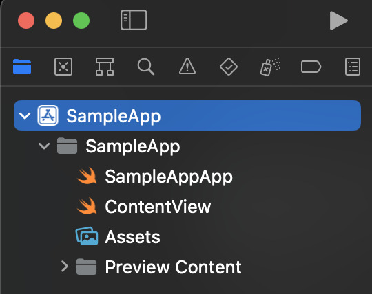

# Bidstack IronSource Adapter Installation Guide for iOS

The Bidstack IronSource Adapter for iOS allows you to display Interstitial and Rewarded ads in your app through IronSource Mediation.

## Table of contents

* [Prerequisites](#prerequisites)
   * [Configuring adapter in the IronSource dashboard](#configuring-adapter-in-the-ironsource-dashboard)
   * [Configuring ad units](#configuring-ad-units)
* [Integration](#integration)
   * [Using CocoaPods](#using-cocoapods)
   * [Adding xcframeworks manually](#adding-xcframeworks-manually)
* [Privacy](#privacy)
* [Supported versions](#supported-versions)

## Prerequisites

**Required:** iOS version 12+

**Required:** If you're planning to integrate the adapter manually, then you need to [download](https://console.bidstack.com/developer/downloads) **BidstackCustomAdapterIronSource.xcframework**, **BidstackMobileAdsSDK.xcframework** and **BidstackMobileAdsSDKResources.bundle** provided by Bidstack.

Before integrating the adapter, you will need to set up the Bidstack network in your IronSource account as documented [here](https://developers.is.com/ironsource-mobile/general/custom-adapter-setup/) or follow the instructions in the section [Configure the ad network account settings](#configuring-adapter-in-the-ironsource-dashboard) and integrate the IronSource SDK as documented [here](https://developers.is.com/ironsource-mobile/ios/ios-sdk/).
<div class="page-break"></div>

### Configuring adapter in the IronSource dashboard

1. Log in to your IronSource account, go to **Monetize > Setup > SDK Networks** and click **Manage Networks**

    

2. Select Custom Adapter at the end of the list

    
    <div class="page-break"></div>

3. When prompted for **Network Key**, enter **15bb61a5d**

    

4. Once IronSource recognizes the key, you should see **Bidstack Ads** as **Name**
5. Your **Publisher Key** is the email address that you signed up to AdConsole with
6. Your **Reporting API key** will be provided by Bidstack
7. For the Reported Revenue section - select Rate-based revenue due to new instances having no historical data and no eCPM, you should set a rate on the instance until the actual eCPM is populated.

    
    <div class="page-break"></div>

### Configuring ad units

You will need to gather API key and ad unit IDs, which can be obtained in [AdConsole](https://console.bidstack.com/auth/login).
Once you have obtained the credentials, set them up in your IronSource account as documented [here](https://developers.is.com/ironsource-mobile/general/custom-adapter-setup/#step-3).

1. In the IronSource dashboard, go to **Monetize > Setup > SDK Networks** and scroll down to the **Custom** section. Then press on the pencil icon alongside the Bidstack adapter

    

2. Here you will need to enter the API key and ad unit name from the AdConsole. Also, you can manually specify the rate to prioritize Bidstack Ads. To add more than 1 ad unit ID select **+Add Network Instance**

    
    <div class="page-break"></div>

3. Login into your AdConsole account and add a new game or select existing

    

4. From the navigation menu, select **SDK control panel** and copy the API key. Paste this API key in the IronSource dashboard field **API key**

    

5. From the navigation menu, select **Ad units**. And then create and copy the ad unit name. Also, paste the ad unit name in the IronSource dashboard filed **Ad unit ID**

    
    <div class="page-break"></div>

## Integration

There are two ways you can integrate **BidstackCustomAdapterIronSource** into your project - using CocoaPods or adding xcframeworks manually.

### Using CocoaPods

Add to your podfile:
`pod 'BidstackCustomAdapterIronSource', '~> 2.4.0'`

That's it! Now you can `pod install` from your Terminal and **BidstackCustomAdapterIronSource** and **BidstackMobileAdsSDK** will be installed automatically. No additional steps are needed.

### Adding xcframeworks manually

#### 1. Create **Frameworks** folder

Firstly, double-check if your Xcode project contains a **Frameworks** folder in the project navigator. If it doesn’t, just like in the screenshot below, then you’ll have to create one. The Frameworks folder is not added by default in the latest Xcode, and it’s a good practice to keep your frameworks there.



Right-click on your project in the project navigator (top-most entry) and select **New Group**. Name the new group **Frameworks**.


<div class="page-break"></div>

#### 2. Add BidstackCustomAdapterIronSource.xcframework, BidstackMobileAdsSDK.xcframework, and BidstackMobileAdsSDKResources.bundle to the Frameworks folder

With the **Frameworks** folder selected, click on **File -> Add Files** to “Your Project”


Find the **BidstackCustomAdapterIronSource.xcframework**, **BidstackMobileAdsSDK.xcframework**, and **BidstackMobileAdsSDKResources.bundle** in the file navigator, select it, make sure “Copy items if needed” and “Create groups” are selected, and click **Add**:


<div class="page-break"></div>

#### 3. Verify that frameworks were added correctly by following these steps:

1. Navigate to your project settings by clicking on it in the project navigator.
2. Select your target and open the **General** tab.
3. Make sure that **BidstackCustomAdapterIronSource.xcframework** and **BidstackMobileAdsSDK.xcframework** have **Do Not Embed** selected.

    
    <div class="page-break"></div>

4. Navigate to the **Build Phases** tab and open the **Copy Bundle Resources** section
5. Assure that **BidstackMobileAdsSDKResources.bundle** is added

    

The **BidstackCustomAdapterIronSource.xcframework** and **BidstackMobileAdsSDK.xcframework** are now fully added and integrated with your Xcode project. No additional setup is needed

<div class="page-break"></div>

## Privacy

Bidstack provides APIs for passing privacy flags. Note that nothing in this document should be considered as legal advice.
If the user provided consent, set the following flag to `true`:

* Objective-C:
    ```objectivec
    [BidstackMobileAds setHasConsent: YES];
    ```
* Swift
    ```swift
    BidstackMobileAds.setHasConsent(true)
    ```

If the user is a child, set the following flag to `true`:

* Objective-C:
    ```objectivec
    [BidstackMobileAds setIsChildDirected: YES];
    ```
* Swift
    ```swift
    BidstackMobileAds.setIsChildDirected(true)
    ```

## Supported Versions

* iOS 12 and up
* IronSourceSDK 7.9.0.0 and up
